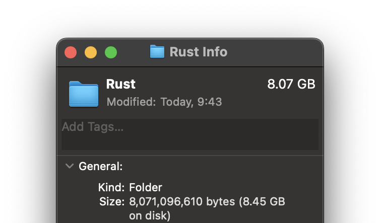
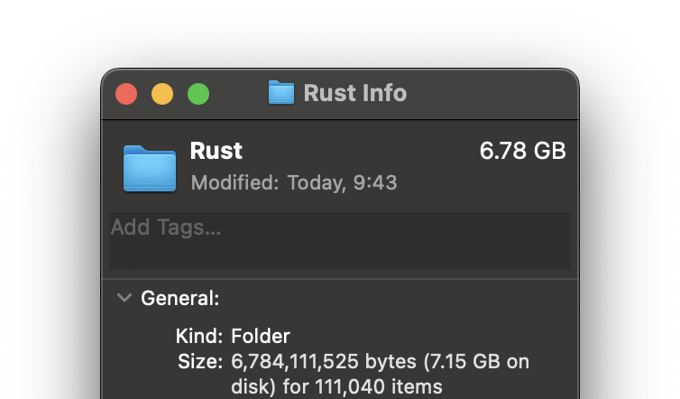

# README (JP/EN)

----------------------JP----------------------

## ⚠️注意

このプログラムはまだ**バージョン0.x(=不安定版)**です。もし重要なファイルを削除してしまった場合、申し訳ありませんが一切の責任を負いかねます。

## 使用方法

### [リリースページ](https://github.com/Uliboooo/all_cargo_clean/releases/tag/ver.0.1.0) から実行ファイルをダウンロードする。

1. 実行ファイルをダウンロードしたディレクトリに移動する。
1. 実行ファイルを実行する。

```bash: usages
./all_cargo_clean dir_path
sucess 👈 ```bash: usages # ./all_cargo_clean dir_path.
```

## 効果

### 実行前

このプログラムを実行する前のdirectory_sizeは8.07GBである。


### 実行後

directory_sizeが1.29GB減少 (**ただし、削除率はプロジェクトのキャッシュサイズやプロジェクト数に依存する**)


## 気になる点

このプログラムがフォルダの奥まで削除できるかどうかはまだ確認していません。

## 免責事項

本ソフトウェアを使用したことによるいかなる損害、損失、不具合についても、私、私の関連会社、および私が所属するいかなる団体、組織も責任を負いません。本ソフトウェアの使用は自己責任でお願いします。

----------------------EN----------------------

## ⚠️caution

This program is still **version 0.x(=unstable)**. Maybe this program don't delete file you need, if delete important file, sorry.but i don't take no reponsibility.

## usages

### download Executable file in [release page](https://github.com/Uliboooo/all_cargo_clean/releases/tag/ver.0.1.0)

1. go to direcotory that Executable file downloaded
1. run Executable file.

```bash: usages
# 
./all_cargo_clean dir_path
# sucess 👈
```

## effect

### before

directory_size is 8.07GB before run this program.


### after

directory_size reduce 1.29GB (**but Deletion rate depends on the size of the cache of project and number of projects.**)


## Points of concern

i don't confirm this program can clean deep inside folder yet.

## Disclaimer

I, my affiliates, and any groups or organizations to which I belong are not responsible for any damage, loss, or malfunction that may result from the use of this software. Please use this software at your own risk.